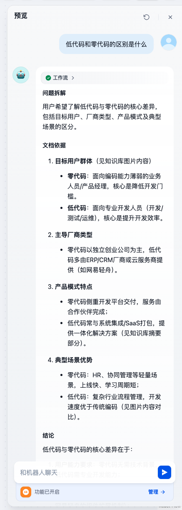
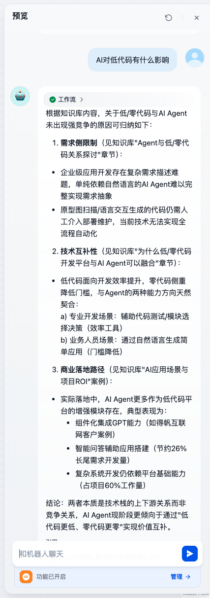
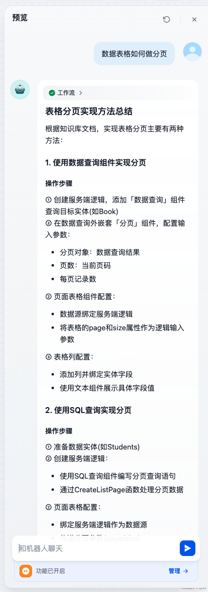
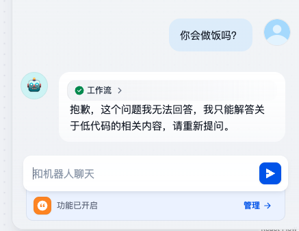

# 对话流

## 概念与理解

> 引导用户去做一件事情，以对话形式的工作流。

面向对话类情景的工作流编排模式，用于构建需要多轮对话交互的应用，如客户服务、语义搜索等。它就像是一个精心设计的对话流程框架，从用户输入问题开始，到生成回答，再到用户对回答进行追问或修改要求等多轮交互，都有明确的流程和节点来处理。

案例：低代码咨询

```txt
低代码咨询

1、根据用户询问的问题进行分支
2、用户询问低代码选型或者前景等问题，根据白皮书知识库（CodeWave介绍资料）进行回答
3、用户询问CodeWave平台使用问题。根据官网文档知识库进行回答
4、若问其他问题则引导用户提问上面两类问题

使用到的组件节点
1、开始
2、问题分类器
3、知识检索
4、LLM
5、直接回复

```


## 测试用例

测试用例1

输入：低代码与零代码的区别

回答



测试用例2

用户输入：AI对低代码有什么影响

回答



测试用例3

用户输入：数据表格如何做分页

回答



用户输入：你会做饭吗？

回答：

