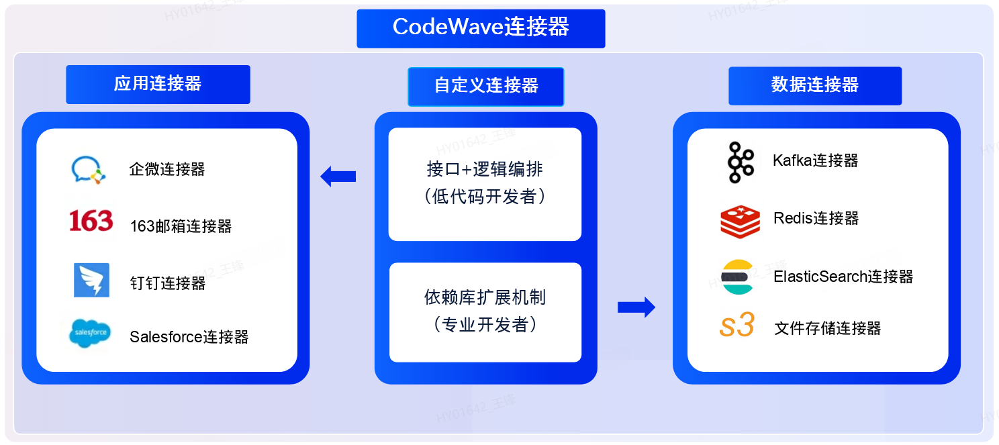
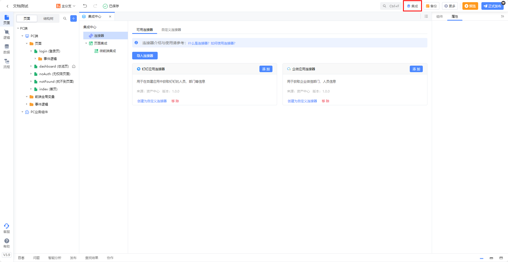
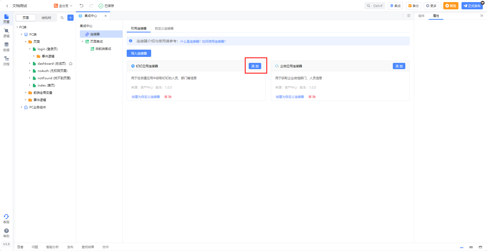
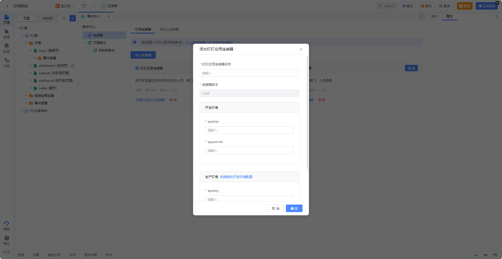
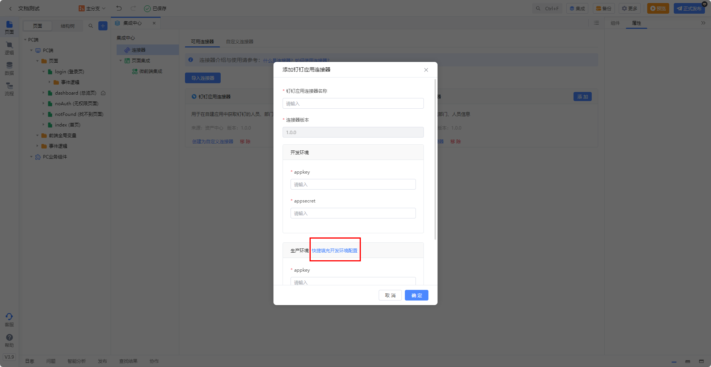
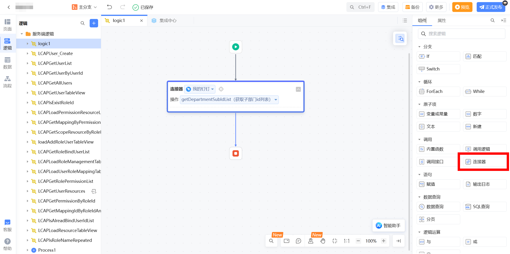
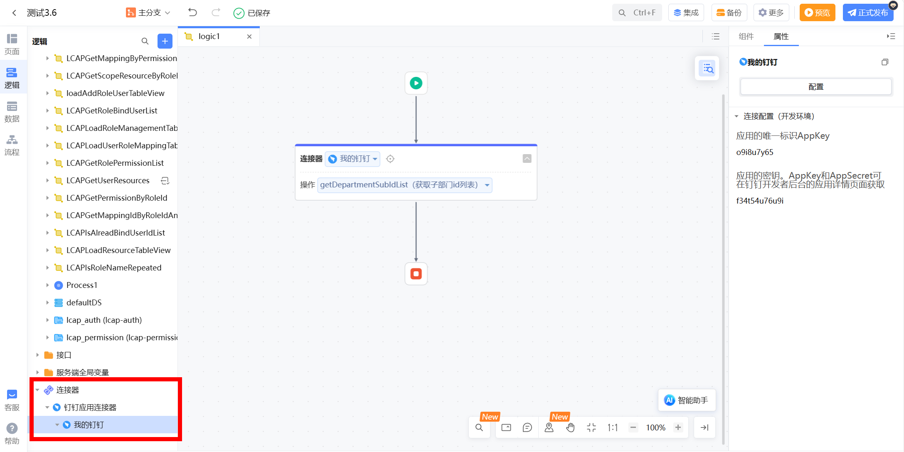

# CodeWave连接器

## CodeWave官网

[CodeWave](https://codewave.163.com/)

## 什么是连接器？

### 1. 连接器的概念

CodeWave平台的连接器是一种用于连接第三方服务、系统或数据源的工具。通过CodeWave平台的连接器，开发者可以在轻松地访问其他系统中的数据和功能，从而实现不同系统之间的数据交换和应用集成。

   

### 2. 连接器的种类

从开发方式上，可以通过低代码（在线IDE）的方式开发连接器，也可以通过编写Java代码来开发连接器。

- **低代码开发的连接器**：本质上是对API调用的封装，封装好了接口信息、请求体及响应体、接口鉴权方式，调用此类连接器时本质上就是调用了接口。比较典型的有：

  - 企业微信连接器：用于与企业微信进行通信的工具，可以将企业微信中的组织架构，消息通知等信息传输到CodeWave平台应用中。企业微信连接器通常用于企业内部通信、消息通知和应用集成等场景。

  - 钉钉连接器：用于与钉钉进行通信的工具，可以将钉钉中的组织架构，消息通知等信息传输到CodeWave平台应用中。钉钉连接器通常用于企业内部沟通、任务管理和应用集成等场景。

- **高代码开发的连接器**：能力较为灵活，类似于服务端依赖库，通过编写Java代码的方式来为低代码应用实现一些扩展能力。比较典型的有：

  - Redis连接器：用于与 Redis 数据库进行通信的工具，可以轻松地将 Redis 中的数据导入到其他系统中。Redis连接器通常用于实时数据分析、数据同步和缓存管理等场景。

  - Kafka连接器：用于与 Kafka 消息队列进行通信的工具，可以将 Kafka 中的数据传输到其他系统中。Kafka连接器通常用于流式数据处理、数据管道和数据集成等场景。

### 3. 如何使用连接器

#### 3.1 配置连接器

1. 功能入口：IDE顶部集成中心

    

2. 选择要使用的连接器，点击**添加**。

    

3. 填写连接器需要的配置（每种连接器的配置可能不同，下图以钉钉连接器为例）。

   

4. 可通过“快捷填充开发环境配置”功能将开发环境配置复制填写到生产环境配置。

   

#### 3.2 调用连接器

**调用前请确保连接器配置已填写正确**。

- 调用方式1：通过拖拽逻辑组件“连接器”调用连接器。

   

- 调用方式2：拖拽连接器下的连接配置调用连接器。

   

### CoreAgent连接器附件

已经封装好的CoreAgent连接器：[CoreAgent连接器](./assert/asset-center_jystudy2_connector_coragent_1.0.0_连接器_coreAgent连接器_1.0.0.zip)

使用说明

+ 导入后请到系统偏好设置打开元数据功能
+ 执行工作流的输入参数inputs类型为元数据JSON，赋值只需要使用文本赋值，并且文本里面是标准的JSON结构，是否标准可以去JSON在线网站进行验证：[JSON在线格式化](https://www.json.cn/)
+ 注意由于CoreAgent每个人智能体最后输出的结构不一样，大家使用前记得使用自定义连接器根据自己的智能体设置输出outputs的结构
+ 流式输出请参考CodeWave官方文档中心[连接器使用SSE协议](https://community.codewave.163.com/CommunityParent/fileIndex?filePath=40.%E6%89%A9%E5%B1%95%E4%B8%8E%E9%9B%86%E6%88%90%2F20.%E9%9B%86%E6%88%90%E5%BC%80%E5%8F%91%E6%96%B9%E5%BC%8F%2F20.%E8%BF%9E%E6%8E%A5%E5%99%A8%E9%9B%86%E6%88%90%2F30.%E8%87%AA%E5%AE%9A%E4%B9%89%E8%BF%9E%E6%8E%A5%E5%99%A8%2F18.%E8%BF%9E%E6%8E%A5%E5%99%A8SSE%E5%8D%8F%E8%AE%AE%E4%BB%8B%E7%BB%8D.md&version=3.10&selectType=codewave)
+ 导入连接器后鉴权参数只需要在CoreAgent创建的ApiKey