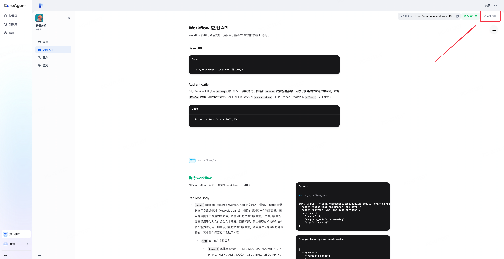
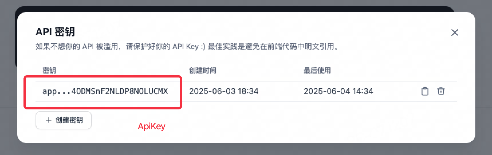

# CoreAgent接口

## 调用域名

### 所有接口调用的域名如下

每个接口前面都需要这段调用域名

```Code
https://coreagent.codewave.163.com/v1
```

### Authentication鉴权

如何鉴权呢？

每创建一个对话流、工作流、聊天助手，他们的访问API中API密钥存有当前智能体的标识，即一个智能体对应一个API密钥(ApiKey)


