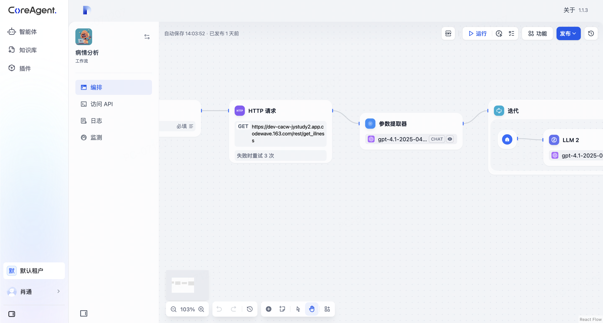
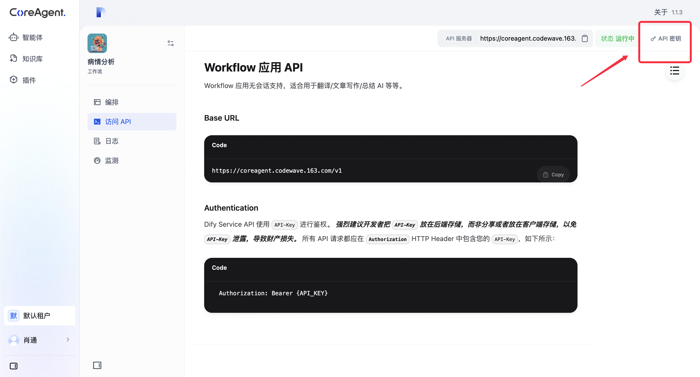
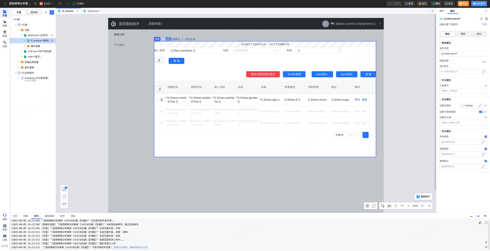
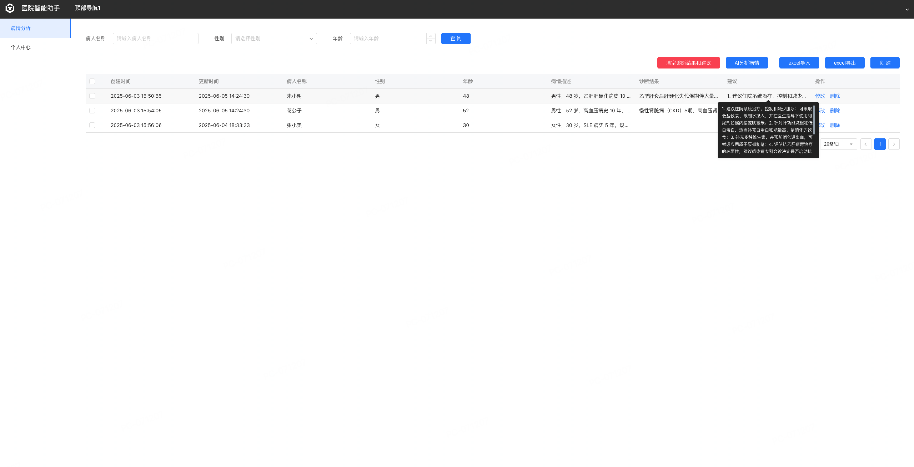
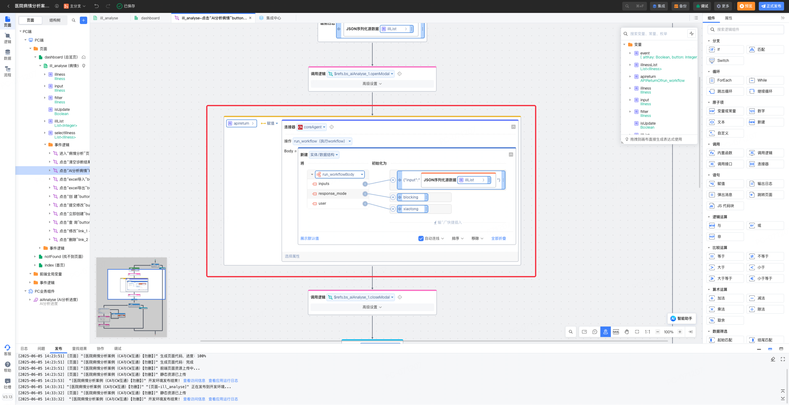

# CoreAgent如何集成CodeWave
## CoreAgent创建智能体
在CoreAgent中创建并根据业务编排好智能体
   

## 获取ApiKey
点击访问API，右上角获取ApiKey，并且可以看到各个接口文档，当然也可以直接查看CoreAgent接口
   

## CodeWave实现业务
在CodeWave搭建自己的业务
```text
示例：医生通过病情描述，AI自动分析并修改数据表格中的诊断与建议数据。
```
   
   

## CodeWave使用连接器
如何导入连接器参考[CodeWave连接器](codewave.md)

在需要调用AI智能体的逻辑中调用连接器并设置输入数据
+ input使用JSON元数据，只需要字符串输入规范的JSON
+ output输出结构需要去集成中心自行根据自己的智能体进行配置

   

## 实现案例模版
[CACW病情分析局部模版](https://github.com/netease-lcap/coreagent-course/raw/refs/heads/main/docs/codewave/assert/asset-center_jystudy2_segment_cacw_1.0.0_%E5%B1%80%E9%83%A8%E6%A8%A1%E6%9D%BF_CACW%E5%8C%BB%E9%99%A2%E7%97%85%E6%83%85%E5%88%86%E6%9E%90_1.0.0.zip)

## CoreAgent提供调用接口

[CoreAgent接口鉴权](./coreagentAuth.md)

[CoreAgentg工作流接口](./coreagentWorkflow.md)

[CoreAgentg聊天助手&对话流接口](./coreagentChat.md)

## CodeWave提供连接器集成接口

[CodeWave连接器](./codewave.md)
