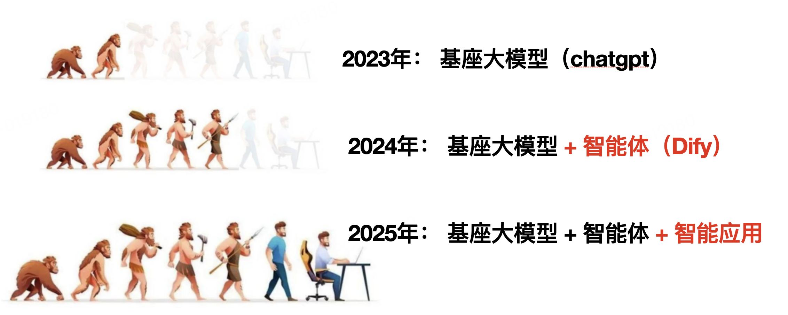
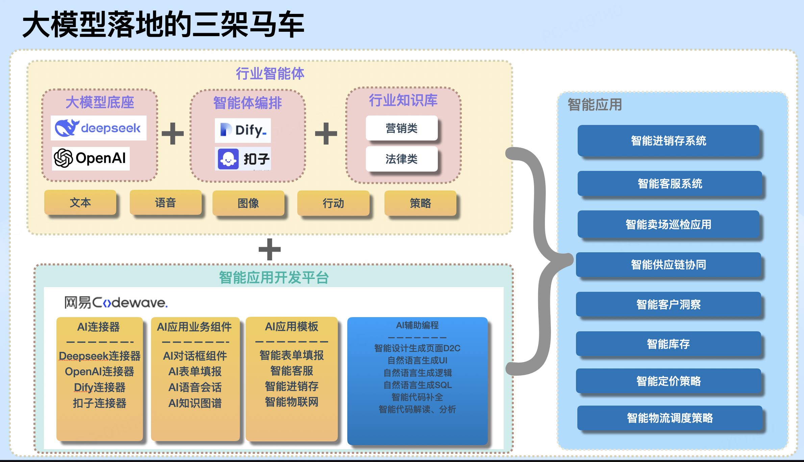

# 大模型应用架构

大模型、智能体和知识库是人工智能领域中紧密关联的三个概念，它们既有区别又相互协作，共同推动智能系统的发展。以下是三者的关系解析：

### **一、核心概念定义**
#### **1. 大模型（Large Model）**
- **定义**：基于深度学习的超大规模神经网络模型，通过海量数据训练获得强大的通用语义理解、生成和推理能力。  
  *例如*：GPT-4、PaLM、LLaMA等。  
- **特点**：  
  - 参数量庞大（数十亿至数万亿），具备强大的上下文建模能力。  
  - 擅长处理自然语言、图像、语音等多模态数据，但缺乏针对具体任务的“专属逻辑”。  
  - 需要通过微调（Fine-tuning）或提示工程（Prompt Engineering）适配特定场景。

#### **2. 智能体（Agent）**
- **定义**：具有自主性、目标导向的智能实体，能够通过感知环境、决策和行动完成特定任务。  
  *例如*：智能客服、自动驾驶系统中的决策模块、AI助手（如Siri、ChatGPT的插件功能）。  
- **特点**：  
  - 包含**感知层**（获取环境信息）、**决策层**（基于规则或模型生成动作）、**执行层**（与环境交互）。  
  - 强调“任务导向”，需结合具体场景设计流程（如任务分解、工具调用、反馈优化）。  
  - 可独立运行，也可与其他智能体协作（如多智能体系统）。

#### **3. 知识库（Knowledge Base）**
- **定义**：结构化存储的知识集合，包含事实、规则、经验等，用于支持智能系统的推理和决策。  
  *例如*：维基百科知识库（Wikidata）、医学知识库（SNOMED CT）、企业内部数据库。  
- **特点**：  
  - 数据组织形式多样：结构化（如数据库表）、半结构化（如JSON）、非结构化（如文档、图片）。  
  - 支持快速检索、知识推理（如逻辑推导、语义关联）和知识更新。  
  - 是智能系统“知识来源”的核心，解决大模型“事实性错误”或“实时数据缺失”问题。

### **二、三者的关系：协作与互补**
#### **1. 大模型是智能体的“认知引擎”**
- **智能体依赖大模型实现复杂推理**：  
  智能体在处理自然语言理解、生成对话、逻辑推理等任务时，需调用大模型的能力。  
  *例如*：客服智能体通过大模型解析用户问题意图，生成自然语言回复。  
- **大模型为智能体提供通用能力底座**：  
  大模型的泛化能力使智能体无需为每个任务单独训练模型，降低开发成本。  
  *例如*：同一大模型可支持教育、医疗、金融等多领域智能体。

#### **2. 知识库是智能体的“记忆与工具”**
- **知识库为智能体提供领域知识**：  
  智能体在处理专业任务（如法律咨询、医疗诊断）时，需调用知识库中的结构化知识，确保回答的准确性和合规性。  
  *例如*：医疗智能体通过医学知识库匹配症状与疾病，避免大模型“虚构事实”。  
- **知识库支持智能体的长期记忆与更新**：  
  大模型的“记忆”限于单次对话上下文，而知识库可存储历史数据、用户偏好等长期信息，实现个性化服务。  
  *例如*：电商智能体通过用户行为知识库推荐商品，提升转化率。

#### **3. 智能体是大模型与知识库的“桥梁”**
- **智能体调度大模型与知识库协同工作**：  
  - **场景1**：用户提问“2025年世界杯举办地”，智能体先调用大模型生成初步回答，再通过知识库验证事实（如国际足联官网数据），确保答案准确。  
  - **场景2**：企业智能体处理报销流程时，使用大模型解析报销单文本，结合知识库中的财务规则（如报销限额、审批流程）自动完成审核。  
- **智能体封装复杂逻辑，降低使用门槛**：  
  大模型和知识库的能力需通过智能体的“任务流程设计”转化为用户可直接使用的服务（如API接口、交互界面）。

### **三、典型应用场景**
#### **1. 智能客服系统**
- **大模型**：理解用户问题语义（如“我的订单何时发货”），生成自然语言回复。  
- **智能体**：设计对话流程（如引导用户提供订单号、查询物流状态、触发退款流程），调用外部工具（如物流API）。  
- **知识库**：存储产品信息、常见问题解答、政策规则（如退换货条款），辅助大模型生成准确回答。

#### **2. 医疗诊断辅助系统**
- **大模型**：分析病历文本（如主诉、检查结果），生成初步诊断建议。  
- **智能体**：根据诊断流程调用知识库中的医学指南（如WHO疾病分类标准），验证大模型结论，并提示医生补充检查。  
- **知识库**：包含疾病知识库、药物相互作用数据库、最新诊疗指南，确保诊断符合临床规范。

#### **3. 自动驾驶系统**
- **大模型**：处理视觉/雷达数据（如识别行人、交通信号），预测路况变化。  
- **智能体**：基于交通规则知识库（如限速、让行规则）和大模型输出，决策驾驶动作（加速、刹车、转向）。  
- **知识库**：存储地图数据、交通法规、历史事故案例，辅助智能体优化决策策略。

### **四、挑战与未来趋势**
#### **1. 当前挑战**
- **数据一致性**：大模型生成内容可能与知识库事实冲突，需建立冲突检测与修正机制。  
- **实时性**：知识库更新滞后可能导致智能体决策过时，需结合实时数据接口（如新闻API、传感器数据）。  
- **计算成本**：大模型推理和知识库检索的资源消耗较高，需优化调度算法（如按需调用、缓存机制）。

#### **2. 未来趋势**
- **动态知识库与大模型融合**：通过持续学习（如增量训练）使大模型吸收知识库的最新知识，减少对外部检索的依赖。  
- **具身智能体（Embodied Agent）**：结合物理世界感知（如机器人传感器）、大模型推理和领域知识库，实现更复杂的环境交互（如家庭服务、工业巡检）。  
- **隐私与安全**：通过联邦学习、加密检索等技术，确保知识库敏感数据（如医疗记录、企业机密）在智能体调用过程中的安全。

### **总结**
- **大模型**是智能系统的“大脑”，提供通用认知能力；  
- **知识库**是智能系统的“记忆”，确保知识的准确性和时效性；  
- **智能体**是“执行者”，通过协调大模型与知识库，将能力转化为具体任务的解决方案。  
三者的深度融合正在推动AI从“单一功能工具”向“通用型智能系统”演进，未来将在更多垂直领域实现复杂场景的自动化与智能化。