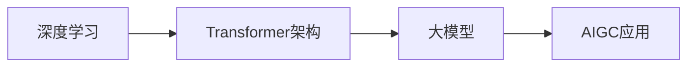

### AIGC、Transformer、深度学习、大模型的关系：技术栈中的协同与演进

#### **一、核心概念定义**
1. **深度学习（Deep Learning, DL）**  
   - 基于神经网络的机器学习分支，通过多层非线性结构自动提取数据特征，依赖大数据和算力，是现代AI的基础技术（如CNN、RNN）。

2. **Transformer**  
   - 一种深度学习架构，由Vaswani等人在2017年提出，核心是**自注意力机制（Self-Attention）**，解决了传统循环神经网络（RNN）处理长序列时的效率问题，广泛应用于自然语言处理（NLP）、图像生成等领域（如BERT、GPT系列均基于Transformer）。

3. **大模型（Large Model）**  
   - 具有超大规模参数（通常数十亿至数万亿）的预训练模型，基于深度学习架构（尤其是Transformer），通过海量数据训练获得跨领域泛化能力，如GPT-4（1.8万亿参数）、PaLM 2（5400亿参数）。

4. **AIGC（人工智能生成内容）**  
   - 利用AI技术自动生成文本、图像、音频、视频等内容的领域，是AI技术落地的应用场景，依赖深度学习模型（尤其是大模型）实现生成能力，如ChatGPT（文本生成）、DALL·E（图像生成）。


#### **二、技术关系：从底层架构到应用场景**



#### **1. 深度学习：底层技术基石**
- **地位**：所有后续技术的基础，提供神经网络框架（如卷积层、循环层、注意力机制）。  
- **与Transformer的关系**：  
  Transformer是深度学习的一种具体实现，属于**神经网络架构创新**，其自注意力机制是深度学习领域的重要技术突破。  
- **与大模型的关系**：  
  大模型本质上是**超大规模的深度学习模型**，依赖深度学习的训练框架（如PyTorch、TensorFlow）和算法优化（如反向传播、梯度下降）。


#### **2. Transformer：连接深度学习与大模型的桥梁**
- **技术突破**：  
  - 并行处理长序列，解决RNN的序列依赖瓶颈，效率更高。  
  - 自注意力机制让模型更精准捕捉数据中的语义关联（如文本中单词的上下文关系）。  
- **对大模型的支撑**：  
  - 大模型几乎全部基于Transformer架构（如GPT系列、LLaMA、PaLM），因其扩展性强，适合堆叠层数和参数规模（如GPT-4有125层解码器）。  
  - Transformer的“编码器-解码器”结构（如BERT）或纯解码器结构（如GPT）为大模型的预训练提供了标准化框架。


#### **3. 大模型：深度学习规模化的产物**
- **规模化三要素**：  
  - **数据规模**：万亿级文本/图像数据（如GPT-3训练数据量约45TB）。  
  - **参数规模**：数十亿至数万亿参数（如PaLM 2为5400亿，GPT-4推测为1.8万亿）。  
  - **算力规模**：依赖上万块GPU/TPU集群训练（如GPT-3训练成本约数千万美元）。  
- **与AIGC的关系**：  
  大模型是AIGC的**核心驱动力**，其强大的生成能力源于：  
  - **预训练能力**：在海量数据中学习通用模式，如语言规律、图像像素分布。  
  - **上下文理解**：Transformer的自注意力机制支持长上下文处理（如GPT-4支持3.2万token输入），生成内容更连贯。  
  - **涌现能力**：参数超过临界点后，模型自发具备逻辑推理、代码生成等复杂能力，直接推动AIGC从“简单模仿”到“创造性生成”。


#### **4. AIGC：技术落地的应用层**
- **核心依赖**：  
  AIGC的实现需整合深度学习模型（尤其是大模型）、数据处理技术和行业场景需求。例如：  
  - **文本生成**：GPT系列（基于Transformer的大模型）通过深度学习训练，生成自然语言文本。  
  - **图像生成**：Stable Diffusion结合Transformer（文本编码器）和卷积神经网络（图像解码器），实现“文本生成图像”。  
- **技术演进路径**：  
  ```
  传统生成模型（如RNN） → 深度学习生成模型（如GAN、Transformer） → 大模型生成（如GPT-4、Sora） → AIGC工业化应用
  ```


#### **三、关键对比与关联**
| 维度         | 深度学习               | Transformer          | 大模型                 | AIGC                   |
|--------------|------------------------|----------------------|------------------------|------------------------|
| **本质**     | 机器学习分支           | 深度学习架构         | 超大规模深度学习模型   | 应用场景               |
| **核心价值** | 特征自动提取           | 长序列高效处理       | 通用智能与生成能力     | 内容生产自动化         |
| **依赖关系** | 基础技术               | 依赖深度学习框架     | 依赖Transformer架构     | 依赖大模型和深度学习   |
| **典型案例** | CNN（图像识别）        | BERT（文本理解）     | GPT-4（通用生成）      | ChatGPT（对话生成）    |


#### **四、总结：技术生态的协同发展**
1. **深度学习**提供了从数据中学习的底层框架；  
2. **Transformer**通过架构创新解决了序列处理的效率问题，成为大模型的“骨架”；  
3. **大模型**通过规模化训练（数据、参数、算力）将深度学习的能力推向新高度，实现通用生成能力；  
4. **AIGC**则是这一系列技术的**应用出口**，将模型能力转化为实际生产力（如内容创作、代码生成、科学发现）。  

这一链条体现了AI技术从“理论创新”到“工程实现”再到“产业落地”的完整路径，而Transformer和大模型是其中的关键转折点，推动AI从“感知智能”迈向“生成智能”。