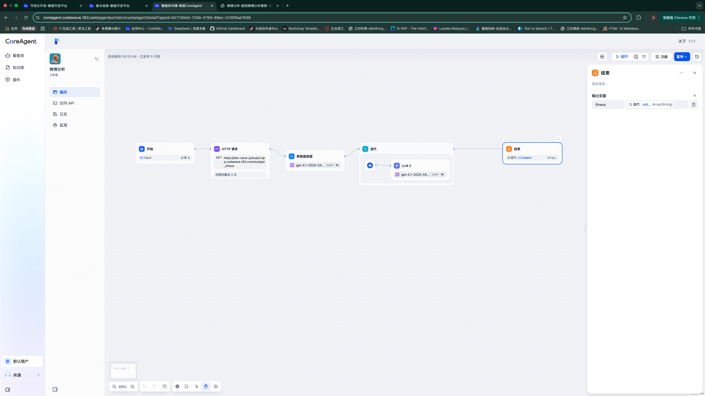
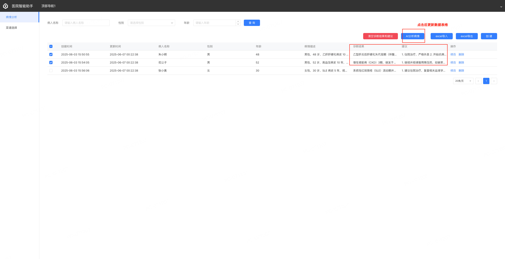

# 病情分析

## 题目描述

医院数据后台管理，医生填入了病情，使用AI工作流自动分析病情并得出诊断结果与医嘱建议

要求使用CA与CW进行结合

## ✍️ 任务要求

1. 构建数据实体展示病情
2. 数据表格设置多选表格，对选中的数据进行分析
3. 数据分析后填入数据库并刷新
4. 构建分析病情智能体，对选中的数据进行病情分析得到诊断结果与建议并返回

### Agent工作流设计

+ 传入用户输入的选中数据id列表
+ 调用接口进行数据查询
+ 对数据进行LLM分析
+ 提取参数并返回对应的结构体

### 工作流图例

### 业务功能图例

### 测试用例

自行先搭建数据实体

[数据SQL下载](https://raw.githubusercontent.com/netease-lcap/coreagent-course/refs/heads/main/docs/test/assert/websql_export_jystudy2-dev-cacw-qc3bym_CqaLw.sql)

## 📝 提交方式说明

本次实操题无需上传文件，请按照以下流程提交你的成果：

1. 在 CoreAgent 系统中创建一个工作流（WorkFlow），名称建议为“病情分析- 张三作品”；
2. 在该智能体工作流中完成以下内容：

* **配置提示词（Prompt）**：包含角色、背景、任务、输出格式等要素；
* **配置智能体编排流程**：在 WorkFlow 中添加以下节点：
  + 开始
  + 参数提取器
  + 迭代
  + HTTP请求
  + LLM
  + 结束

3. 在 CodeWave 系统中创建一个页面搭建业务，名称建议为“病情分析- 张三作品”；
