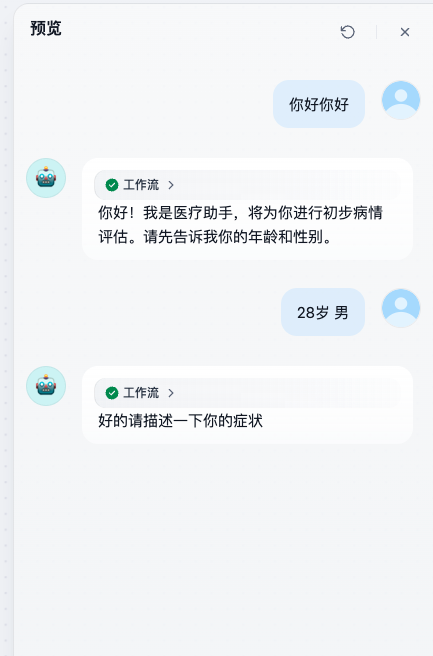
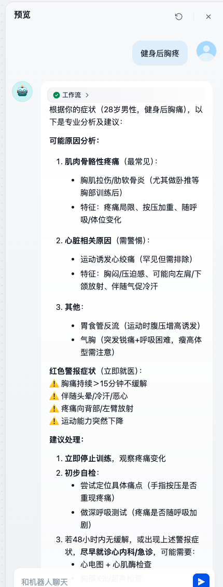

# 问诊小助手

## 题目描述

请以问诊小助手完成以下任务，构建一个能够“**引导用户问诊**”的对话流。

你需要从提示词设计、对话流的编排等维度，完成以下内容：

## ✍️ 任务要求

### Agent对话流编排要求

+ 询问病情
+ 如果没说年龄和岁数，就提示要说年龄和岁数
+ 如果说了年龄岁数，但是没说具体病情，提示说病情
+ 如果都说了开始分析病情并给出建议

### 对话流示例图

## 测试用例

用户输入：你好你好

回答

用户输入：28岁 男

回答

用户输入：健身后胸疼

回答

## 📝 提交方式说明

本次实操题无需上传文件，请按照以下流程提交你的成果：

1. 在 CoreAgent 系统中创建一个对话流（ChatFlow），名称建议为“问诊小助手- 张三作品”；
2. 在该智能体对话流中完成以下内容：

   * **配置提示词（Prompt）**：包含角色、背景、任务、输出格式等要素；
   * **配置智能体编排流程**：在 ChatFlow 中添加以下节点：
     + 开始
     + LLM
     + 参数提取器
     + 条件分支
     + 直接回复