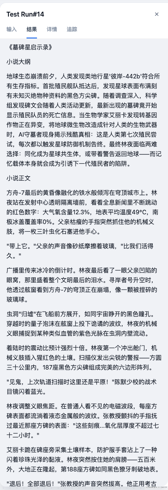

# 短篇小说作家

## 题目

1、根据用户输入，AI生成创意点子
2、根据创意点子搜索互联网并创作小说大纲
3、根据大纲生成小说的概要
4、根据小说大纲和概要分别生成小说的开场、发展、冲突、高潮、结局
5、统一后结束返回

使用到的组件节点
1、开始
2、LLM
3、参数提取器
4、工具-Google搜索
5、代码执行
6、结束

> 做案例时Google搜索无法使用

## 测试用例

用户输入：帮我写一段关于地球人类由于环境问题必须发现新的适合生存的行星的短篇小说

输出

